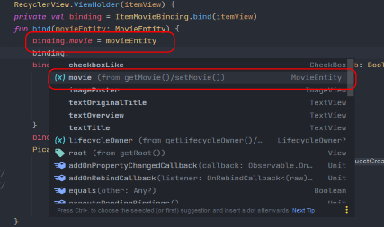

# Vinculación de vistas viewBinding y dataBinding

La vinculación de vista es una función que te permite escribir más fácilmente código que interactúa
con las vistas. Una vez que la vinculación de vista está habilitada en un módulo, genera una clase
de vinculación para cada archivo de diseño XML presente en ese módulo. Una instancia de una clase de
vinculación contiene referencias directas a todas las vistas que tienen un ID en el diseño
correspondiente.

En la mayoría de los casos, la vinculación de vistas reemplaza a findViewById.

## Gradle

En el archivo [app/build.gradle](../../../../../../../build.gradle) se _ la vinculación de vistas
dentro de la sección de buildFeatures.

```gradle
plugins {
    ...
}

android {
    ...
    buildFeatures {
        viewBinding true
        dataBinding true
    }
}
```

# Ejemplos

## Binding

### Activity

#### Java

```java
public class SplashActivity extends AppCompatActivity {
    @Override
    protected void onCreate(@Nullable Bundle savedInstanceState) {
        super.onCreate(savedInstanceState);
        var binding = ActivitySplashBinding.inflate(getLayoutInflater());
        var viewModel = new ViewModelProvider(this).get(SplashViewModel.class);
        setContentView(binding.getRoot());
    }
}
```

#### Kotlin

```kotlin
class SplashActivity : AppCompatActivity() {
    override fun onCreate(savedInstanceState: Bundle?) {
        super.onCreate(savedInstanceState)
        val binding = ActivitySplashBinding.inflate(
            layoutInflater
        )
        val viewModel = ViewModelProvider(this)[SplashViewModel::class.java]
        setContentView(binding.root)
    }
}
```

### Fragment

#### Kotlin

```kotlin
class BudgetFragment : Fragment() {

    private lateinit var binding: FragmentBudgetBinding
    private lateinit var viewModel: BudgetViewModel
  
    override fun onCreateView(
        inflater: LayoutInflater, container: ViewGroup?,
        savedInstanceState: Bundle?
    ): View {
        binding = FragmentBudgetBinding.inflate(inflater, container, false)
        viewModel = ViewModelProvider(this)[BudgetViewModel::class.java]
        return binding.root
    }
}
```

#### Java

```java
public class BlankFragment extends Fragment {

    private BlankViewModel mViewModel;
    private FragmentBlankBinding binding;

    public static BlankFragment newInstance() {
        return new BlankFragment();
    }

    @Override
    public View onCreateView(@NonNull LayoutInflater inflater, @Nullable ViewGroup container,
                             @Nullable Bundle savedInstanceState) {
        binding = FragmentBlankBinding.inflate(inflater, container, false);
        mViewModel = new ViewModelProvider(this).get(BlankViewModel.class);
        return binding.getRoot();
    }
}
```

### Adapter

#### Kotlin

```kotlin
override fun onCreateViewHolder(parent: ViewGroup, viewType: Int) = MovieViewHolder(
    LayoutInflater.from(parent.context).inflate(R.layout.item_movie, parent, false),
    movieInterface
)
```

#### Java

```java
@NonNull
@Override
public MovieViewHolder onCreateViewHolder(@NonNull ViewGroup parent, int viewType) {
    return new  MovieViewHolder(
    LayoutInflater.from(parent.getContext()).inflate(R.layout.item_movie, parent, false),
    movieInterface
    );
}
```

### ViewHolder

#### Kotlin

```kotlin
class MovieViewHolder(itemView: View, private val movieInterface: (Int, Boolean) -> Unit) :
    RecyclerView.ViewHolder(itemView) {
    private val binding = ItemMovieBinding.bind(itemView)
}
```

#### Java

```java
public class MovieViewHolder extends RecyclerView.ViewHolder {

    private final ItemMovieBinding binding;
    private final MovieInterface movieInterface;

    public MovieViewHolder(@NonNull View itemView, MovieInterface movieInterface) {
        super(itemView);
        binding = ItemMovieBinding.bind(itemView);
        this.movieInterface = movieInterface;
    }
}
```

### dataBinding

Una vez definida la variable binding en la clase, se deberá contener la vista completa dentro del
tag <layout> para
declarar el objeto del pojo en la vista.


### Pojo

#### Kotlin

```kotlin
class MovieEntity(
    var id: Int,
    var title: String,
    var originalTitle: String,
    var overview: String,
    var posterPath: String,
    var like: Boolean
)
```

#### Java

```java
public class MovieEntity {

    private int id;
    private String title;
    private String originalTitle;
    private String overview;
    private final String posterPath;
    private final Boolean like;

    public MovieEntity(int id, String title, String originalTitle, String overview, String posterPath, Boolean like) {
        this.id = id;
        this.title = title;
        this.originalTitle = originalTitle;
        this.overview = overview;
        this.posterPath = posterPath;
        this.like = like;
    }

    public int getId() {
        return id;
    }

    public void setId(int id) {
        this.id = id;
    }

    public String getTitle() {
        return title;
    }

    public void setTitle(String title) {
        this.title = title;
    }

    public String getOriginalTitle() {
        return originalTitle;
    }

    public void setOriginalTitle(String originalTitle) {
        this.originalTitle = originalTitle;
    }

    public String getOverview() {
        return overview;
    }

    public void setOverview(String overview) {
        this.overview = overview;
    }

    public String getPosterPath() {
        return posterPath;
    }

    public Boolean getLike() {
        return like;
    }

}
```

#### Declaración en el layout

```xml
<?xml version="1.0" encoding="utf-8"?>
<layout xmlns:android="http://schemas.android.com/apk/res/android"
    xmlns:app="http://schemas.android.com/apk/res-auto"
    xmlns:tools="http://schemas.android.com/tools">

        <data>

            <variable
                name="movie"
                type="com.example.dagger_hilt.data.datasource.database.entities.MovieEntity" />
        </data>
</layout>
```

Posteriormente, la variable permitirá acceder a los miembros del pojo haciendo referencia a le del
siguiente modo:

```xml
    <TextView
        android:id="@+id/text_title"
        style="@style/TextAppearance.AppCompat.Title"
        android:layout_width="match_parent"
        android:layout_height="wrap_content"
        android:layout_margin="16sp"
        android:text="@{movie.title}"      
        app:layout_constraintEnd_toEndOf="parent"
        app:layout_constraintStart_toStartOf="parent"
        app:layout_constraintTop_toBottomOf="@+id/image_poster"
        tools:text="Title" />
```

Para establecer el pojo en la vista, se accede al dato mediante la variable binding.

